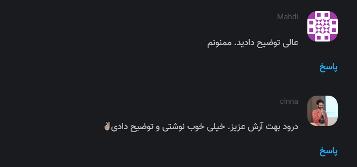

# تنظیمات سرور

فایل تنظیمات سرور نیکاس با فرمت [INI](https://en.wikipedia.org/wiki/INI_file) در نظر گرفته شده است. در این فایل به ازای هر بخش از سرور گزینه های مورد نظر خودمان را تعریف می کنیم. فایل نمونه را در [این آدرس](https://github.com/Nikas-Project/Server/blob/master/example.cfg) می‎توانید مشاهده کنید. این فایل بدین صورت می‎باشد :

```ini
[general]
dbpath = example.db
host = https://arash-hatami.ir/

[server]
listen = http://localhost:1234/

[admin]
enabled = true
password = secret_token
```

جهت استفاده از این فایل آن را با گزینه `c-` به دستور اجرایی خود اضافه کنید یا از متغیر های ENV استفاده کنید :

```bash
nikas -c nikas.cfg
# or
env NIKAS_SETTINGS=path/to/nikas.cfg nikas
```

---

حال به بررسی تنظیمات مختلف سرور می‎پردازیم :

- [General](#general)
- [Moderation]()
- [Server]()
- [SMTP]()
- [Guard]()
- [Hash]()
- [RSS]()
- [Admin]()
- [Environment variables]()

## General

در این بخش تمامی تنظیمات عمومی نیکاس انجام می شود. مقدار پیشفرض آن به این شکل است :

```ini
# Default
[general]
dbpath = /tmp/nikas.db
name =
host =
max-age = 15m
notify = stdout
log-file =
```

### dbpath

آدرس فایل پایگاه داده SQLite3. این آدرس باید در پوشه غیرموقت باشد تا پایگاه داده شما حذف نشود

### name

برای استفاده در حالتی به کار می رود که شما چند وبسایت تعریف کرده باشید. در غیر اینصورت اجباری نیست.

### host

در اینجا باید وبسایت(ها) را تعریف کنید. شما جهت اجرا به حداقل یک وبسایت نیاز دارید. هدف از این بخش مسائل امنیتی بوده و به دلیل استفاده از [CORS](https://developer.mozilla.org/en/docs/HTTP/Access_control_CORS) جهت محدود کردن نمایش نظرات در وب سایت مقصد باید آدرس وبسایت های خودتان را تعریف کنید.

پیشنهاد می شود ابتدا وبسایت های HTTP را تعریف کنید ( non-SSL ).

```ini
[general]
host =
    http://website.ir/
    https://website.ir/
```

> در صورتی که نیکاس نتواند هنگام اجرای اولیه به حداقل یکی از این وبسایت ها متصل شود ، پیغام خطایی در ترمینال داده می‎شود.

### max-age

بازه زمانی مجاز که به کاربران اجازه ی ویرایش یا حذف نظرات داده می شود.

### notify

سیستم اعلام دریافت نظر برای نظرات جدید :

- **stdout** : این مورد به صورت پیشفرض فعال بوده و نظرات جدید در قالب خروجی عادی در ترمینال نمایش داده می شوند
- **smtp** : اعلان از طریق ایمیل برای شما ارسال خواهد شد. توجه داشته باشید که در صورت استفاده از این گزینه باید تنظیمات [SMTP](#smtp) را نیز انجام دهید.

### reply-notifications

با استفاده از این گزینه به کاربران اجازه داده می شود تا تعیین کنند در صورت ثبت پاسخ برای نظرشان به آنها ایمیلی ارسال شود.

> قبل از استفاده این مورد حتما تنظیمات مناسب را در قسمت [Moderation](#moderation) انجام دهید تا از اسپم ها جلوگیری شود. همچنین باید تنظیمات [SMTP](#smtp) نیز انجام شده باشد

### log-file

با استفاده از این گزینه تمامی رخداد ها با جای اینکه در خروجی ترمینال نمایش داده شوند در یک فایل ذخیره خواهند شد.

### gravatar

در صورتی که این گزینه را فعال کنید ، نیکاس از [Gravatar](https://en.wikipedia.org/wiki/Gravatar) برای نمایش تصویر کاربران استفاده خواهد کرد. البته به شرطی که کاربر مورد نظر هنگام ارسال نظر آدرس ایمیل خودش رو نیز ثبت کرده باشه. در غیر اینصورت یک آیکون رندوم به آن اختصاص داده می شود.



## Moderation

در این قسمت Queue پردازش برای نظرات جدید را فعال می کنیم.

```ini
# Default
[moderation]
enabled = false
approve-if-email-previously-approved = false
purge-after = 30d
```

### enabled

فعال کردن گزینه مدیریت. بدین صورت که نظرات پس از ثبت باید توسط مدیریت تایید شوند. نظرات تایید شده به صورت عمومی نمایش داده نخواهند شد.

### approve-if-email-previously-approved

اگر این گزینه فعال باشد ؛ در صورتی که کاربر مورد نظر با ایمیل وارد شده حداقل در 6 ماه گذشته یک نظر تایید شده داشته باشد ، نظر فعلی وی نیز خودکار تایید خواهد شد.

> این گزینه کاربردی است ولی اگر کاربری به طور اتفاقی آدرس ایمیل درستی را حدث بزند یا به جای فرد دیگری که آن را می شناسد نظری با آدرس ایمیل وی ثبت کند می تواند نظر اسپم در سایت نمایش دهد. **پس با ریسک خودتان این گزینه را فعال نمایید**

### purge-after

با استفاده از این گزینه می توانید مشخص کنید نظرات تایید نشده پس از چند روز به طور خودکار حذف شوند

## Server

تنظیمات اصلی HTTP Server نیکاس در این بخش صورت می‎پذیرد.

```ini
# Default
[server]
listen = http://localhost:8080
reload = off
profile = off
```

### listen

آدرسی که باید سرور با آن کار کند. نیکاس از TCP/IP و UNIX domain socket پشتیبانی می‎کند

```ini
# UNIX domain socket
listen = unix:///tmp/nikas.sock
# TCP/IP
listen = http://localhost:1234/
```

در نیکاس از [gevent](https://github.com/gevent/gevent) استفاده شده است و به طور خودکار برای TCP/IP به کار می‎رود اما نمی‎تواند درخواست های HTTP را روی UNIX domain socket مدیریت کند.

> جهت اطلاعات بیشتر به [#299](https://github.com/surfly/gevent/issues/299) و [#295](https://github.com/surfly/gevent/issues/295) مراجعه کنید.

### public-endpoint

آدرس عمومی که سرور نیکاس با آن در دسترس خواهد بود. برای مثال `nikas.domain.ir`. باید به صورت آدرس کامل نوشته شود :

```ini
public-endpoint = https://nikas.domain.ir
```

در صورتی که این مقدار خالی گذاشته شود نیکاس سعی می کند به طور خودکار آدرس را تشخیص دهد. از این مقدار وقتی استفاده کنید که آدرس عمومی با آدرس تعیین شده در `listen` متفاوت باشد.

> برای مثال وقتی از Docker استفاده می کنید آدرس های listen و public با یکدیگر متفاوت هستند

### reload

با فعال کردن این گزینه در صورتی که سورس برنامه تغییر کند ، نیکاس ریستارت می شود. فقط برای حالت توسعه مناسب است و در محیط عملیاتی Production کاربردی ندارد

### samesite

این گزینه مقدار `Set-Cookie` را در `SameSite` تعیین می‎کند. زمانی به کار می رود که نیکاس در دامنه یکسانی هاست نشده باشد. برای مثال از `domain.ir` فراخوانی شده و در `comments.domain.ir` هسات شده است.

به صورت پیشفرض نیکاس مقدار `SameSite=None` را برای ارتباط https و `SameSite=Lax` را برای http در نظر می‎گیرد.

> جهت اطلاعات بیشتر به [MDM: SameSite](https://developer.mozilla.org/en-US/docs/Web/HTTP/Headers/Set-Cookie/SameSite) مراجعه کنید

مقادیر قابل تعریف در این بخش : `None`, `Lax`, `Strict`

## SMTP

نیکاس می‎تواند از طریق ارسال ایمیل شما را از ثبت نظر های جدید اگاه کند. همچنین در ایمیل های دریافتی توانایی تایید یا حذف نظرها را نیز دارید.

جهت این کار باید یک سرور ایمیل داشته باشید و به عنوان SMTP Server در نیکاس تعریف کنید.

```ini
[smtp]
# Default
username =
password =
host = localhost
port = 587
security = starttls
to =
from =
timeout = 10
```

### username

نام کاربری سرور ایمیل

### password

کلمه عبور سرور ایمیل

> پیشنهاد می شود یک حساب کاربری جدا برای این کار در نظر بگیرید

### host

آدرس آی پی یا دامنه سرور ایمیل

### port

پورت سرور ایمیل

### security

استفاده از اتصال ایمن و رمز شده SSL برای اتصال به سرور ایمیل. مقادیر قابل تعریف : `none`, `starttls`, `ssl`.

> متاسفانه پیاده سازی اعتبارسنجی گواهینامه ها در پایتون سخت تر از چیزی است که فکر می کنید. نیکاس به طور ساده و با استفاده از کتابخانه های آماده ای که وجود داره این کار رو انجام میده و در مواردی معتبر نبودن گواهینامه هارو میتونه Ignore کنه. ترجیحا از موارد معتبر استفاده کنید و حتما برای نیکاس از حساب کاربری ایمیل مجزا استفاده کنید.

### to

آدرس ایمیل مقصد که می‎خواهید برای آن هشدار ها ارسال شود

### from

آدرس فرستنده ، برای مثال : `Nikas <nikas@domain.ir>`

### timeout

اختصاص timeout به صورت ثانیه جهت اتمام عملیات های مربوط به ایمیل مانند ارسال یا اتصال به سرور

## Guard

نیکاس یک سیستم داخلی جهت تشخیص و جلوگیری از اسپم نیز دارد. در این بخش می توانید آن را فعال و تنظیم نمایید. اصلی ترین حساسیت آن به صورت rate-limit بر اساس آدرس آی پی می باشد.

```ini
# Default
[guard]
enabled = true
ratelimit = 2
direct-reply = 3
reply-to-self = false
require-author = false
require-email = false
```

### enabled

فعال کردن سیستم ضداسپم

### ratelimit

اعمال محدودیت بر اساس تعداد نظر بر دقیقه. برای مثال `ratelimit = 2` یعنی به هر آدرس آی پی اجازه داده می شود در هر دقیقه فقط 2 نظر ارسال کند.

### direct-reply

با استفاده از این گزینه می‎توانید مشخص کنید چه تعداد نظر به صورت مستقیم به هر تاپیک ارسال شود.

### reply-to-self

به کاربران اجازه داده می شود تا برای نظرات خودشان پاسخی ثبت کنند. البته این مورد فقط برای وقتی است که آنها هنوز فرصت ویرایش نظر را دارند. پس از آن که مسلما هر کاربری می تواند به نظر خودش پاسخ دهد.

### require-author

با فعال کردن این گزینه کاربران مجبور به ثبت نام خود برای ارسال نظر می‎شوند.

> باید کلاینت را نیز تنظیم کنید

### require-email

با فعال کردن این گزینه کاربران مجبور می‎شوند جهت ثبت نظر آدرس ایمیل خود را نیز وارد کنند.

> باید کلاینت را نیز تنظیم کنید

## Hash

نیکاس از توابع و الگوریتم های Hashing استفاده می کند تا آدرس ایمیل نظر دهنده را از باقی کاربران مخفی کند و در عین حال identicon ها را نیز بسازد.

```ini
[hash]
# Default
salt = Eeqh7co8Ohlospo9Ol6baimi # Example
algorithm = pbkdf2
```

### salt

از `salt` برای جلوگیری از حملات [Rainbow table](https://en.wikipedia.org/wiki/Rainbow_table) استفاده می‎شود.

### algorithm

الگورتیم Hash که می‎خواهید از آن استفاده شود. می توانید بین `hashlib` و `pbkdf2` یکی را انتخاب کنید.

> تنظیمات pbkdf2 به این صورت می‎باشد : `pbkdf2:1000:6:sha1`
