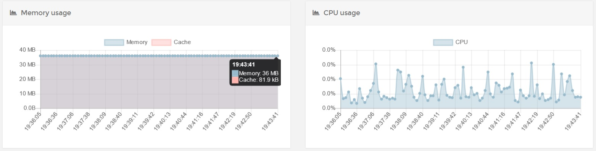

# نیازمندی ها

نیکاس برای شما حداقل نیازمندی ها را در نظر گرفته است.

## سخت افزار

از لحاظ سخت افزاری به زیرساخت قوی جهت اجرای نیکاس نیاز ندارید. در حالت عادی و بدون فعالیت مصرف RAM و CPU بسیار پایینی دارد :



و در هنگام لود بالا نیز مصرف منابع آن بدین صورت است :

image

---

## نرم افزار

نیکاس با زبان پایتون نوشته شده است. اگر فکر می کنید که اجرا و استقرار یک پروژه پایتون به راحتی پروژه های PHP است کاملا در اشتباه هستید. بر خلاف PHP در اکثر توزیع های لینوکس از پایتون برای ابزارهای مختلف خود استفاده می کنند. ما نیز در پروژه های پایتون خودمان ابزارهای مختلفی داریم. این کتابخانه ها ( ابزار ها ) با استفاده از Package Manager ها نصب می شوند.

اولین و مهمترین قانونی که با آن برخورد می کنید این است که هرگز دستورات PyPi را به صورت root اجرا نکنید. و این به خاطر احتمال وجود برنامه های مخرب نیست ، بلکه به خاطر جلوگیری از اختلال در سیستم عامل است.

جهت مطالعه بیشتر به [این لینک](https://workaround.org/easy-install-debian) بروید.

خوشبختانه پایتون راهی پیش روی ما قرار داده تا کتابخانه های خودمان را به راحتی نصب و استفاده کنیم بدون اینکه نرم افزارهای اصلی یا سیستم عامل دچار مشکل شوند و اون هم `virtualenv` است. جهت نصب آن دستورات زیر را اجرا نمایید :

```bash
# for Debian/Ubuntu
sudo apt-get install python-setuptools python-virtualenv python-dev

# Fedora/Red Hat
sudo yum install python-setuptools python-virtualenv python-devel
```

نیازمندی های اصلی نیکاس :

- Python 3.5+ (+ devel headers)
- SQLite 3.3.8 or later

در صورتی که تمایل به کامپایل و اجرای نیکاس را از سورس دارید ، باید لیست زیر را نصب داشته باشید :

- [Make](https://www.gnu.org/software/make/)
- C compiler
- [NodeJS](https://nodejs.org/en/download/)
- [NPM](https://npmjs.org/)

```bash
# for Debian/Ubuntu
sudo apt-get install python-dev sqlite3 build-essential

# Fedora/Red Hat
sudo yum install python-devel sqlite
sudo yum groupinstall “Development Tools”
```

### Docker

برای نیکاس Docker Image هایی نیز ساخته شده تا از نصب ، کامپایل و راه های سنتی رها شوید. در صورتی که تمایل به استفاده از این ایمیج ها دارید باید Docker را روی سیستم خود نصب داشته باشید :

```bash
# for Ubuntu 20 ( Focal )
sudo apt install apt-transport-https ca-certificates curl software-properties-common
curl -fsSL https://download.docker.com/linux/ubuntu/gpg | sudo apt-key add -
sudo add-apt-repository "deb [arch=amd64] https://download.docker.com/linux/ubuntu focal stable"
sudo apt install docker-ce
sudo usermod -aG docker ${USER}
su - ${USER}
```
