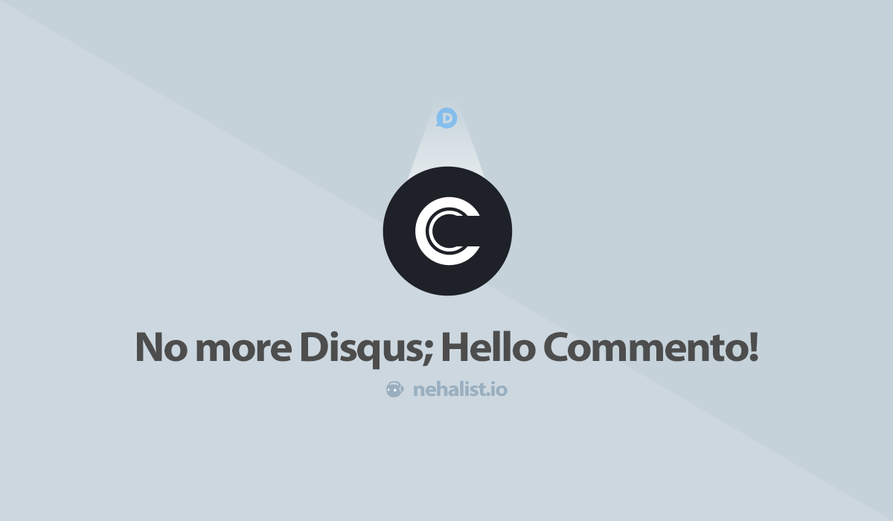

# نمونه های مشابه

شاید همین الان که از وب سایت نیکاس دیدن کردید به فکر نمونه های مشابه اون هم بیوفتید. بیاید نگاه کوچیکی به اون ها داشته باشیم

## Disqus

اولین و مهمترین نمونه ی مشابه نیکاس رو میشه Disqus دونست. ولی متاسفانه به راحتی نمیشه ازش داخل ایران استفاده کرد !!!

## Commento

این پلتفرم یکی از رقبای اصلی Disqus بوده که با بهبود هایی در زمینه های سرعت بارگذاری ، سبک بودن داده ها و رعایت حریم شخصی همراه است. یک گزینه ایده آل ولی **غیر رایگان**.
البته طرح رایگان هم وجود داره ولی مدت استفاده محدودی داره و گزارش هایی مبنی بر حذف داده ها بدون هشدار قبلی وجود داره.

## utterances 🔮

این مورد هم گزینه بعدی شما است. یه سیستم نظرگذاری ساده و جمع و جور ولی بر پایه Github Issue. یعنی برای هر وب سایت باید یک ریپازیتوری داشته باشید و هرکدام از نظرات شما در قالب یک Issue ثبت خواهند شد. ایده خوب و جالبیه و جدیدا هم خیلی جاها چنین راهکارهایی استفاده میشه ولی راستش رو بخواید زیاد جالب نیست !!

## HashOver

یکی از نمونه های متن باز موجود هم HashOver هست. با PHP نوشته شده و قابل شخصی سازیه ولی اصلا ظاهر مدرن و امروزی نداره و بیشتر برای وبسایت های 30 سال پیشه 😁

---

نمونه های بسیار زیاد دیگری هم وجود داره. رایگان ، غیر رایگان ، متن باز و ...
در نیکاس ویژگی های اصلی و مفید هرکدام از اون ها وجود داره :

-   متن باز
-   سبک و کم حجم
-   طراحی UI مدرن تر
-   راحتی در استفاده
-   ...
